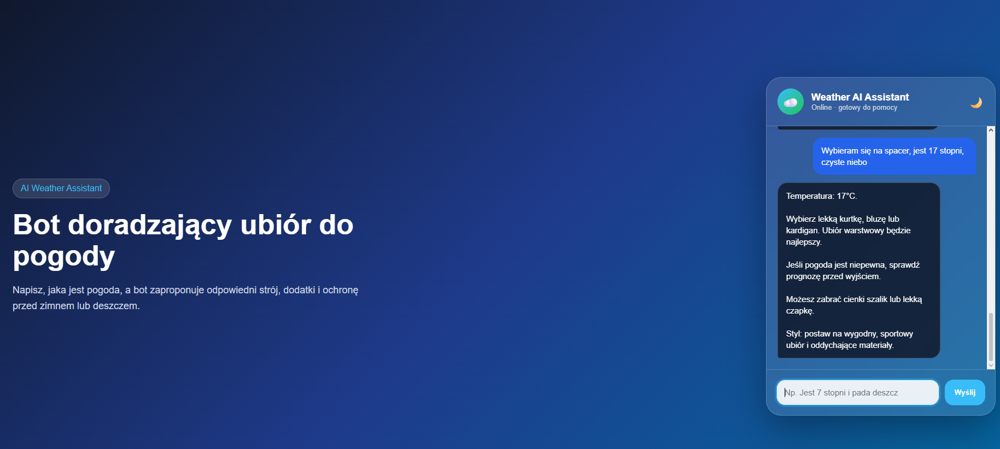
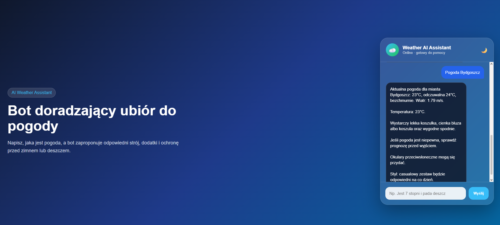
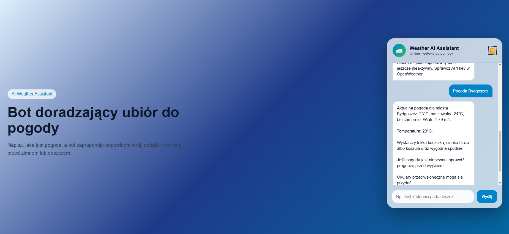

# Weather AI Assistant

## Opis projektu

Weather AI Assistant to prosty chatbot webowy, który doradza użytkownikowi odpowiedni ubiór na podstawie opisu pogody. Użytkownik wpisuje temperaturę oraz warunki pogodowe, a bot generuje rekomendację dotyczącą stroju, dodatków, ochrony przed deszczem, zimnem lub słońcem.

## Technologie

- HTML5
- CSS3
- JavaScript Vanilla
- Responsive Web Design
- LocalStorage
- Fetch API
- OpenWeather API

## Funkcjonalności

- Interfejs czatu
- Dynamiczne odpowiedzi bota
- Analiza temperatury z tekstu użytkownika
- Rozpoznawanie warunków pogodowych
- Rekomendacja stroju
- Rekomendacja dodatków
- Rekomendacja stylu ubioru
- Tryb jasny i ciemny
- Animacja pisania
- Zapisywanie historii rozmowy w LocalStorage
- Responsywny wygląd dla desktopu, tabletu i telefonu
- Pobieranie aktualnej pogody z OpenWeather API
- Obsługa zapytań typu „pogoda Bydgoszcz”
- Obsługa błędów API, np. niepoprawne miasto lub błędny klucz API

## Architektura rozwiązania

```text
Użytkownik
   ↓
Interfejs czatu HTML/CSS
   ↓
JavaScript Chat Engine
   ↓
Pobranie wiadomości z pola input
   ↓
Analiza treści wiadomości
   ↓
┌───────────────────────────────┐
│ Czy użytkownik podał miasto?   │
└───────────────────────────────┘
        ↓ Tak                         ↓ Nie
Fetch API + OpenWeather API       Logika warunkowa JS
        ↓                         ↓
Pobranie temperatury, opisu       Analiza temperatury,
pogody i wiatru                   deszczu, śniegu, wiatru
        ↓                         ↓
Normalizacja danych pogodowych    Generowanie rekomendacji
        ↓                         ↓
Rekomendacja ubioru, dodatków i ochrony
   ↓
Wyświetlenie odpowiedzi w oknie czatu
   ↓
Zapis historii rozmowy w LocalStorage
```

## Przykładowe rozmowy

Użytkownik:

```text
- Jest 7 stopni i pada deszcz

- Temperatura: 7°C.

Załóż ciepłą kurtkę, bluzę lub sweter oraz długie spodnie.

Ponieważ pada deszcz, zabierz parasol lub załóż kurtkę przeciwdeszczową i wodoodporne buty.

Dobrym dodatkiem będzie cienka czapka albo komin.

Styl: casualowy zestaw będzie odpowiedni na co dzień.
```


## Uwagi

Do działania integracji z OpenWeather wymagany jest własny klucz API.

Ze względów bezpieczeństwa klucz API nie został umieszczony w repozytorium. Aby uruchomić integrację lokalnie, należy wpisać własny klucz w pliku `script.js` w zmiennej `OPENWEATHER_API_KEY`.

W środowisku produkcyjnym klucz API powinien być obsługiwany po stronie backendu, a nie bezpośrednio w kodzie frontendowym.

## Screenshots




